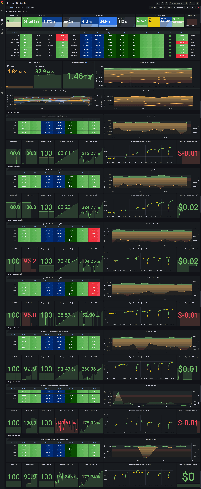

## About

This repository is forked off of [anclrii/Storj-Exporter-dashboard](https://github.com/anclrii/Storj-Exporter-dashboard), which unfortunately has gone quiet. This repository was created to update the dashboards and allow others to commit their own dashboards as well. All original work is credited to anclrii (Thank you!).

# Storj Exporter dashboard
Storj-exporter Grafana dashboard to visualise [Storj-Exporter](https://github.com/thechristech/Storj-Exporter) metrics for multiple Storj storage nodes. See my [quick-start guide](quick_start/) to set up the whole stack using docker-compose.

 

## Installation on existing Grafana instance:
Import Storj-Exporter-Boom-Table.json via your Grafana UI ("+" -> Import), select your Prometheus datasource at the top-left of the dashboard.

Alternately, **import by ID**, simply paste in 20677, which is the [grafana dashboards entry](https://grafana.com/grafana/dashboards/20677) for this repo.

## Installing full monitoring stack
Monitoring stack required for this dashboard includes the following components:

* [Storj-Exporter](https://github.com/thechristech/Storj-Exporter) - collects storagenode metrics
* [Prometheus](https://prometheus.io/) server - scrapes and stores metrics from Storj-Exporter
* [Grafana](https://grafana.com/) - pulls data from Prometheus and visualises it
    * Storj-Exporter-dashboard - a template dashboard for Storj-Exporter metrics

Here's how metrics flow through the stack:

---

**Storagenode => Storj-Exporter => Prometheus server => Grafana (Storj-Exporter-dashboard)**

---

See the [quick-start guide](quick_start/) to set up the whole stack using docker-compose.

Alternatively check out links below for other ways to install/configure these components:

* Storj-Exporter - https://github.com/thechristech/Storj-Exporter#installation
* Prometheus - https://prometheus.io/docs/prometheus/latest/installation/
* Grafana - https://grafana.com/docs/grafana/latest/installation/

### Ansible role
There's an ansible role [toconspiracy/storj-beastmode](https://github.com/toconspiracy/storj-beastmode/tree/stable) for storagenodes that features all above monitoring components.  
